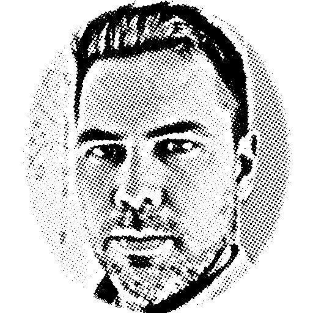

Ham Radio project notebook and log for VE3MAL (Jay),
an Amateur Radio operator in southern Ontario. "Hamdad" who
looks to share a passionate interest in understanding technology, building new things, and getting out into
nature.

Projects topics include QRP, kit building, antenna design, HF digimodes and CW, VHF FM and APRS. Digital Voice, Hotspots, POTA, and more.
  
Member of Kitchener Amateur Radio Club ([KWARC](http://www.kwarc.org/)) and 
Radio Amateurs of Canada ([RAC](https://www.rac.ca/)). 
Find on Mastodon @ve3mal@mastodon.radio, and on the #Amateurradio channel on 
the Geekshed IRC Network.

## Around the Web:
* [Mastodon](https://mastodon.radio/@ve3mal)
* [HamQTH](https://www.hamqth.com/ve3mal)
* [QRZ](https://www.qrz.com/db/VE3MAL)
* [Github](https://github.com/JasonLocklin)
* [Geekshed IRC](https://kiwiirc.com/client/irc.geekshed.net/#amateurradio)

  
  
  
