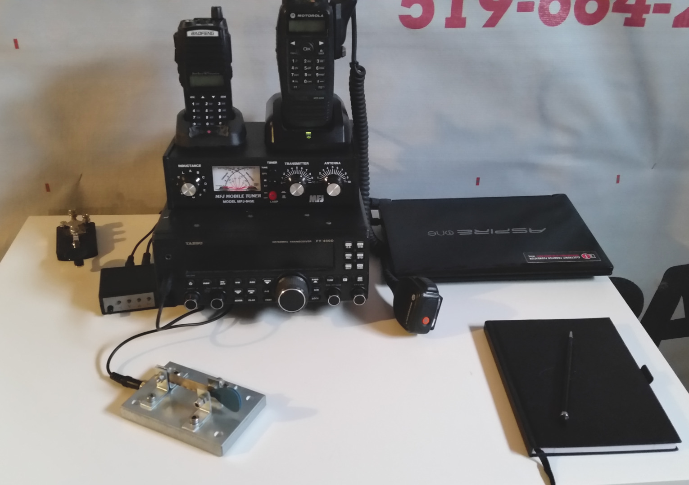

## QTH
Kitchener, situated in the Waterloo Region of Ontario, is my adoptive home town. Initially drawn here for studies at the University of Waterloo, I quickly
became attached to the region. It's industrial heritage and innovation sector that includes 2 world-class universities and a vibrant vocational college
make it a great place for inquisitive minds.
Resting on the ancestral lands of the Haudenosaunee, Anishinaabe, and Chonnonton People, the land was settled in violation of the Haldimand Treaty of 1784. For more information, see [Six Nations of the Grand River](https://www.sixnations.ca/key-issues/land-rights).

## HF Station
I currently operate an IC-7300. At home, it is powered via a Jetstream JTPS32MAB switching
power supply and feeds a 40m horizontal full wave loop in my attic. The feed system includes
a 4:1 Guanella balun and 1:1 choke balun at the feed point, and a second 1:1 at the shack end
along with a MFJ-945E mobile tuner that can be used when necessary.

## QRP Portable Station
I use a CW-only Youkits 4 band HB1B QRP transceiver while camping and pota. It's 5w out, and I use a variety of wire
antennas, combined with a "Mini SWR indicator" that I built from Pacific Antenna to tune them.
I use a [PicoKeyer](http://www.hamgadgets.com/ULTRA-PICOKEYER) with it. I find the 4 memories
and speed knob to be indispensable and I mounted a [QRPGuys](http://www.hamgadgets.com/ULTRA-PICOKEYER)
paddle directly to it for convenience.

## FM
I usually have my Yaesu FT-3dr handheld radio with me. It us used for APRS, FM repeaters, and
with a MMDVM Pi-Star hotspot using YSF digital voice. A little radio "Swiss army knife,"
it also receives just about anything, including Broadcast AM, shortwave (AM), FM, Marine, Aviation, Weather,
public safety scanning, etc. The UI can be bewildering, but it is great entertainment to
work through any of the many things it can do.
I would like to add a FM mobile radio
to the mix, as well as trying out a [SHARI](http://kitsforhams.com/) allstar hotspot node.

## First Shack
Initially, the first shack was based around a Yaesu FT450d.

Additionally I've used a Yaesu FT60r, Kenwood TM-281a, a Baofeng uv85, and
Motorola HTs as well. The FT450d was a great entry HF radio.
Simple to operate, and
buttons and knobs for most functions, while still being quite portable.
The 3 radios pictured provided HF through UHF, Sideband, CW, digital modes, FM, and digital
voice on UHF! Homemade single lever paddle and MFJ straight key were very cheap, as
was an old ACER netbook for digital modes. Manual tuner was used occasionally to extend
operating bands with homemade wire antennas.  Not pictured: a Kenwood TM-281a for 2m FM, and
Yaesu FT60 HT. The FT60r was a great, simple handheld that feels indestructible. I highly
recommend it. The TM-281a was a good performer, but I did not like that it's minimum
power output was 25w. I prefer a low power option being available.
